# scx_layered

This is a single user-defined scheduler used within [`sched_ext`](https://github.com/sched-ext/scx/tree/main), which is a Linux kernel feature which enables implementing kernel thread schedulers in BPF and dynamically loading them. [Read more about `sched_ext`](https://github.com/sched-ext/scx/tree/main).

## Overview

A highly configurable multi-layer BPF / user space hybrid scheduler.

`scx_layered` allows the user to classify tasks into multiple layers, and apply
different scheduling policies to those layers. For example, a layer could be
created of all tasks that are part of the `user.slice` cgroup slice, and a
policy could be specified that ensures that the layer is given at least 80% CPU
utilization for some subset of CPUs on the system.

## How To Install

Available as a [Rust crate](https://crates.io/crates/scx_layered): `cargo add scx_layered`

## Typical Use Case

`scx_layered` is designed to be highly customizable, and can be targeted for
specific applications. For example, if you had a high-priority service that
required priority access to all but 1 physical core to ensure acceptable p99
latencies, you could specify that the service would get priority access to all
but 1 core on the system. If that service ends up not utilizing all of those
cores, they could be used by other layers until they're needed.

## Production Ready?

Yes. If tuned correctly, `scx_layered` should be performant across various CPU
architectures and workloads.

That said, you may run into an issue with infeasible weights, where a task with
a very high weight may cause the scheduler to incorrectly leave cores idle
because it thinks they're necessary to accommodate the compute for a single
task. This can also happen in CFS, and should soon be addressed for
scx_layered.

## Tuning scx_layered

`scx_layered` is designed with specific use cases in mind and may not perform
as well as a general purpose scheduler for all workloads. It does have topology
awareness, which can be disabled with the `-t` flag. This may impact
performance on NUMA machines, as layers will be able to span NUMA nodes by
default. For configuring `scx_layered` to span across multiple NUMA nodes simply
setting all nodes in the `nodes` field of the config.

For controlling the performance level of different levels (i.e. CPU frequency)
the `perf` field can be set. This must be used in combination with the
`schedutil` frequency governor. The value should be from 0-1024 with 1024 being
maximum performance. Depending on the system hardware it will translate to
frequency, which can also trigger turbo boosting if the value is high enough
and turbo is enabled.

Layer affinities can be defined using the `nodes` or `llcs` layer configs. This
allows for restricting a layer to a NUMA node or LLC. Layers will by default
attempt to grow within the same NUMA node, however this may change to support
different layer growth strategies in the future. When tuning the `util_range`
for a layer there should be some consideration for how the layer should grow.
For example, if the `util_range` lower bound is too high, it may lead to the
layer shrinking excessively. This could be ideal for core compaction strategies
for a layer, but may poorly utilize hardware, especially in low system
utilization. The upper bound of the `util_range` controls how the layer grows,
if set too aggressively the layer could grow fast and prevent other layers from
utilizing CPUs. Lastly, the `slice_us` can be used to tune the timeslice
per layer. This is useful if a layer has more latency sensitive tasks, where
timeslices should be shorter. Conversely if a layer is largely CPU bound with
less concerns of latency it may be useful to increase the `slice_us` parameter.

### Utilization Compensation

On systems where interrupt processing (irq, softirq) or stolen time
concentrates on specific CPUs, those CPUs lose a significant fraction of
their capacity to work that isn't attributed to any layer. Without
compensation, layers running on these CPUs appear to use less CPU time
than they actually need, causing them to under-request CPUs.

When enabled, `scx_layered` computes a per-CPU scale factor from
`/proc/stat` using:

    s[cpu] = Δt / (Δt - irq - softirq - stolen)

Each CPU's per-layer usage delta is multiplied by that CPU's scale
factor before being summed into the layer total, so a layer doing most
of its work on interrupt-heavy CPUs gets more compensation than one on
cold CPUs even if both have the same raw utilization. The compensated
utilization then drives `calc_target_nr_cpus` through the normal
`util_range` mechanism. The scale is clamped to `[1.0, 20.0]`.

The compensated utilization is shown alongside raw utilization in the
per-layer stats output as ` comp_overhead=X.X%` when the layer is
non-trivially active and the raw and compensated values differ
meaningfully.

Compensation is disabled by default and can be enabled with
`--util-compensation` for cases where it is needed. On CPUs with no
interrupt overhead the scale factor is 1.0 and compensated utilization
equals raw utilization, so the flag has no effect on layers that only
run on clean CPUs.

### Memory-bandwidth limits

A Confined or Grouped layer can limit its share of each NUMA node's memory
bandwidth:

```json
"membw_limit": {
  "utilization_range": [0.30, 0.40],
  "action": "Shrink"
}
```

The low and high values are fractions of the node's bandwidth capacity. When a
layer reaches the high watermark on a node, that `(layer, node)` pair becomes
pressured. It remains pressured until its attributed utilization reaches the
low watermark.

- `Hold` prevents the layer from adding CPUs on a pressured node while normal
  utilization-based shrinking remains enabled.
- `Shrink` also lowers the layer's CPU allocation on that node proportionally,
  removing at least one allocation unit per sizing cycle. The layer-wide
  `cpus_range` minimum is always honored.

```mermaid
stateDiagram-v2
    direction LR
    [*] --> Normal
    Normal --> Pressured: attributed bandwidth >= high * capacity
    Pressured --> Normal: attributed bandwidth <= low * capacity
    Normal --> Normal: pass CPU target through
    Pressured --> Pressured: Hold blocks node growth; Shrink lowers node target
```



#### Proportional bandwidth attribution

The hardware PMU event used by `membw_gb` is sampled while each task runs, so
its deltas can be associated with a layer and the NUMA node of the executing
CPU. Root resctrl MBM provides the shared bandwidth total for each monitoring
domain. `scx_layered` groups those domains by NUMA node and apportions each
node's total among all layers, similar to proportional set size:

```text
layer_bandwidth[layer, node] = node_resctrl_bandwidth[node]
                              * layer_pmu_delta[layer, node]
                              / sum_layer_pmu_deltas[node]
```

Every layer participates in the denominator, including layers without a
`membw_limit`, so shared traffic is counted once. The policy is applied only to
layers which configure a limit. If a node has bandwidth activity but no usable
PMU proxy delta, that sample is left unattributed and does not trigger a layer
policy.

This attribution is an estimate. In particular, a core-side PMU event records
the request on the CPU's node and cannot always identify the destination memory
controller for remote accesses or DMA. A future resctrl-per-layer mode can
provide stronger attribution where enough RMIDs are available.

#### Capacity and CPU sizing

No CPU-model-specific bandwidth values are assumed. When at least one layer
configures `membw_limit`, each node's capacity is selected in this order:

1. `--node-membw-capacity-gb N`, applied uniformly to all nodes.
2. HMAT read plus write bandwidth from sysfs.

If neither source is available for every node, `membw_limit` is ignored with a
warning instead of guessing a capacity. Without any `membw_limit` or
`membw_gb` field, memory-bandwidth tracking is disabled and no PMU counter or
resctrl sampling is enabled.

CPU utilization still computes each layer's initial target. The unified
allocator then places that demand across nodes, after which `membw_limit` caps
the selected layer's target on pressured nodes. Unpressured nodes retain their
normal allocations, and competing layers may use the released CPUs. The
existing global `membw_gb` limit composes with this policy; the lower target
wins.

Memory-bandwidth tracking uses one pinned core PMU counter and resctrl mounted
at `/sys/fs/resctrl`. Pinning prevents silent perf multiplexing; scheduler
startup logs a warning and ignores memory-bandwidth limits if the required
event cannot run on every online CPU or resctrl MBM is unavailable. See
`examples/membw_limit.json`.

`scx_layered` can provide performance wins, for certain workloads when
sufficient tuning on the layer config.
